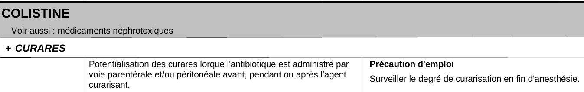

.. pddiansm documentation master file, created by
   sphinx-quickstart on Fri Jul  9 08:53:44 2021.
   You can adapt this file completely to your liking, but it should at least
   contain the root `toctree` directive.

Welcome to pddiansm's documentation!
====================================

The French Agency for the Safety of Health Products (ANSM) publishes guidelines on Potential Drug Drug Interaction (PDDI) at this address: https://ansm.sante.fr/documents/reference/thesaurus-des-interactions-medicamenteuses-1

A program extracts the content of PDF documents and structures them in JSON format: https://github.com/scossin/ExtractThesaurusANSM
The PDF files are available in this repository. 

This package provides an API to query the guidelines, it is used to detect PDDI according to French guidelines. 

Guidelines content
====================================
This is a screenshot of a PDDI in the ANSM document: 

*Colistine* is a substance. It can interact with *Curares*, a drug class.
In this example, Colistine interacts on his own, i.e. this interaction is specific to this substance. 

*Colistine* belongs to the *médicaments néphrotoxiques* drug class. So when looking for PDDIs with Colistine, one must also have a look to PDDIs related to the *médicaments néphrotoxiques* drug class. 

The interaction mechanism is:

   *Potentialisation des curares lorque l'antibiotique est administré par \nvoie parentérale et/ou péritonéale avant, pendant ou après l'agent \ncurarisant.
   (Potentiation of curares when the antibiotic is administered parenterally
   parenteral and/or peritoneal route before, during or after the
   curarizing agent.)*

The severity level is *Précaution d'emploi*. 
There are 4 severity levels in the document:

   1. Contraindicated (contre-indiquée)
   2. Discommended (association déconseillée)
   3. Needing cautious use (précaution d'emploi)
   4. To take into account (à prendre en compte)

Most PDDIs have one severity level. Some PDDIs have multiple severity levels which can depend on quantity of drugs administered or patient medical history. 

Often the document provides information about the severity level. In this example:

   *Surveiller le degré de curarisation en fin d'anesthésie (Monitor the degree of curarization at the end of anesthesia)*

The JSON representation of this PDDI is the following: 

.. code-block:: json

   {
   "main_drug": "COLISTINE",
   "between_main_and_plus_drug": "Voir aussi : médicaments néphrotoxiques",
   "plus_drug": "CURARES",
   "severity_levels": [
      {
         "level": "Précaution d'emploi",
         "info": "Surveiller le degré de curarisation en fin d'anesthésie."
      }
   ],
   "interaction_mechanism": "Potentialisation des curares lorque l'antibiotique est administré par \nvoie parentérale et/ou péritonéale avant, pendant ou après l'agent \ncurarisant.",
   "description": "Précaution d'emploi\nSurveiller le degré de curarisation en fin d'anesthésie.\n\nPotentialisation des curares lorque l'antibiotique est administré par \nvoie parentérale et/ou péritonéale avant, pendant ou après l'agent \ncurarisant."
   }

The severity_levels and the interaction_mechanism are extracted automatically from the description field. This field is not useful but to verify information was correctly structured. 

Also, a "Substance file" stores information about substances and their drug classes. 
The JSON *colistine* entry is the following:

.. code-block:: json

   {
   "substance": "colistine",
   "drug_classes": [
      "médicaments néphrotoxiques",
      "autres médicaments néphrotoxiques"
   ]
   }

Get Started
================

1. Check PDDI between *colistine* and *curares*

The first step is to select a *thesaurus_version*. 
The ANSM interaction working group publishes guidelines once or twice a year. 
The PDDIs detected depend on the selected version. 

   .. code-block:: python

      from pddiansm.detector.PDDIthesaurusDetector import PDDIthesaurusDetector
      from pddiansm.thesaurus.ThesauriJson import ThesauriJson
      
      ThesauriJson().print_available_thesaurus_version()
      thesaurus_version = "2019_09"
      thesaurus = ThesauriJson().get_thesaurus(thesaurus_version) 
      pddi_detector = PDDIthesaurusDetector(thesaurus)
      substance1 = "colistine"
      substance2 = "curares"
      pddis = pddi_detector.detect_pddi(substance1, substance2)
      for pddi in pddis:
         print(pddi)
      # colistine (from 'colistine') can interact with curares (from 'curares') in thesaurus version 2019_09

2. Check PDDI between *colistine* and *mivacurium*

Since *mivacurium* belongs to the *curares* drug class, the former PDDI is also detected between these two substances:  
   
   .. code-block:: python

      substance1 = "colistine"
      substance2 = "mivacurium"
      pddis = pddi_detector.detect_pddi(substance1, substance2)
      for pddi in pddis:
         print(pddi)
      # colistine (from 'colistine') can interact with mivacurium (from 'curares') in thesaurus version 2019_09

3. Check PDDI between two simple drugs

A simple drug is an object, with an id, containing one to many substances. 
Marketed drugs can contain one to several substances, the *PDDIsimpleDrugsDetector* class is used to detect PDDIs between substances of different drugs. 

   .. code-block:: python 
      
      from pddiansm.detector.PDDIsimpleDrugsDetector import PDDIsimpleDrugsDetector
      from pddiansm.detected.PDDIsimpleDrugsDetected import PDDIsimpleDrugsDetected
      from pddiansm.pydantic.interfaces_input import SimpleDrug
      from pddiansm.thesaurus.IThesaurus import IThesaurus
      from pddiansm.thesaurus.ThesauriJson import ThesauriJson
      
      simple_drug1 = SimpleDrug(id=1, substances=["opium", "tiemonium", "colchicine"])
      simple_drug2 = SimpleDrug(id=2, substances=["azithromycine"])
      simple_drugs = [simple_drug1, simple_drug2]
      thesaurus: IThesaurus = ThesauriJson().get_thesaurus("2019_09")
      pddi_detector = PDDIsimpleDrugsDetector(thesaurus)
      pddis_detected = pddi_detector.detect_pddi_multiple_drugs(simple_drugs)
      for pddi_detected in pddis_detected:
          print(pddi_detected)
      # colchicine (from 'colchicine') can interact with azithromycine (from 'macrolides (sauf spiramycine)') in thesaurus version 2019_09. 
      # colchicine comes from drug number '1' and azithromycine comes from drug number '2'

      
4. Check PDDI between two identifiers

You can replace substance names by identifiers and search PDDIs with these identifiers. 
You need to change the mapper object that maps an identifier to one or many substance(s) and drug classe(s). 
This package contains mappings to Wikidata and RxNorm. 
For example, to detect PDDIs between two RxNorm ingredients: 

   .. code-block:: python

      from pddiansm.detector.PDDIthesaurusDetector import PDDIthesaurusDetector
      from pddiansm.thesaurus.ThesauriJson import ThesauriJson
      from pddiansm.detected.PDDIdetected import PDDIdetected
      from pddiansm.mapper.AvailableIdentifierMappers import AvailableSubstanceMapping
      
      thesaurus = ThesauriJson().get_thesaurus("2019_09") 
      pddi_detector = PDDIthesaurusDetector(thesaurus)
      rxnorm_mapper = AvailableSubstanceMapping.RxNorm.value
      pddi_detector.set_mapper(rxnorm_mapper)
      id_rxnorm_colchicine = "2683"
      id_rxnorm_azithromycine = "18631"
      pddis_detected = pddi_detector.detect_pddi(id_rxnorm_colchicine, id_rxnorm_azithromycine)
      for pddi in pddis_detected:
          print(pddi)
      # 2683 (from 'colchicine') can interact with 18631 (from 'macrolides (sauf spiramycine)') in thesaurus version 2019_09

Thesaurus object
****************
A thesaurus object contains a list of PDDIs and substances (with their drug classes)

   .. code-block:: python

      from pddiansm.detector.PDDIthesaurusDetector import PDDIthesaurusDetector
      from pddiansm.thesaurus.ThesauriJson import ThesauriJson
      
      ThesauriJson().print_available_thesaurus_version()
      thesaurus_version = "2019_09"
      thesaurus = ThesauriJson().get_thesaurus(thesaurus_version) 
      len(thesaurus.get_pddis()) # this version contains 3,055 pddis
      len(thesaurus.get_substances_thesaurus()) # and 1,052 substances

To get all the drug classes of colistine::

      filter_colistine = filter(lambda x: x.substance == "colistine", thesaurus.get_substances_thesaurus())
      list(filter_colistine)[0].drug_classes # ['medicaments nephrotoxiques', 'autres medicaments nephrotoxiques']

.. toctree::
   :maxdepth: 2
   :caption: Contents:

Indices and tables
==================

* :ref:`genindex`
* :ref:`modindex`
* :ref:`search`
